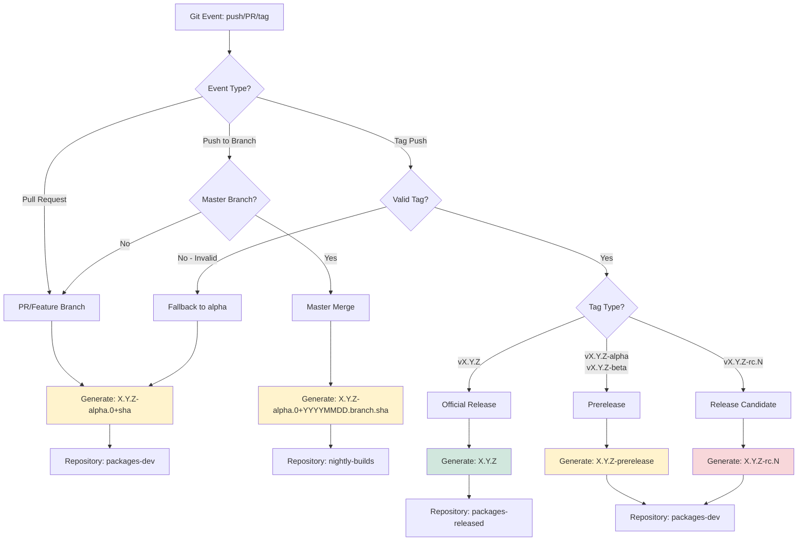

# SemVer Version Generation Scripts

This directory contains scripts for generating Semantic Versioning 2.0 compliant version numbers based on git history and workflow context.

## Understanding Semantic Versioning 2.0

[Semantic Versioning 2.0](https://semver.org/) is a versioning scheme that conveys meaning about the underlying changes.

### Version Format

```
major.minor.patch-prerelease+build_metadata
```

**Core Version** (`major.minor.patch`):
- **MAJOR**: Incremented for incompatible API changes
- **MINOR**: Incremented for backward-compatible new functionality
- **PATCH**: Incremented for backward-compatible bug fixes

**Prerelease** (`-alpha`, `-beta`, `-rc`):
- Optional identifier indicating the software is not yet stable
- Prerelease versions have **lower precedence** than the associated release
- Examples: `1.0.0-alpha.1`, `1.0.0-beta.2`, `1.0.0-rc.1`

**Build Metadata** (`+sha`, `+date.branch.sha`):
- Optional metadata for traceability (commit SHA, build date, etc.)
- Ignored when determining version precedence
- Examples: `1.0.0+abc1234`, `1.0.0-beta.1+20260118.main.abc1234`

### Prerelease Types and When to Use Them

This project follows a standard prerelease progression:

**`alpha`** → **`beta`** → **`rc`** (release candidate) → **release**

#### Alpha (α)
- **Purpose**: Early testing, unstable, may have incomplete features
- **Audience**: Internal developers, early testers, continuous integration
- **Changes**: Frequent breaking changes expected
- **Example**: `1.2.0-alpha.0+abc1234` or `1.2.4-alpha.0+20260118.main.abc1234`
- **When generated**: 
  - Pull requests and feature branch commits
  - **Automatic nightly builds from master/main branch merges** (with date and branch metadata)
  - Invalid or unparseable tags
  - Default for any commit not on a release branch
- **Note**: Auto-generated alpha versions use a naive patch bump (e.g., `v1.2.3` → `1.2.4-alpha.0`), regardless of whether the actual changes warrant a major or minor version increment. This is intentional - nightly builds from master represent ongoing development, not stabilization. For intentional version control or beta/RC releases, create an explicit git tag.

#### Beta (β)
- **Purpose**: Feature-complete but may have bugs, ready for wider testing
- **Audience**: Beta testers, QA teams
- **Changes**: API should be stable, only bug fixes and minor tweaks
- **Example**: `1.2.0-beta.1`
- **When generated**:
  - **Explicit release branches only**: Tags like `v1.2.0-beta` or `v1.2.0-beta.1`
  - **NOT from automatic master/main merges** - Those use alpha instead
- **Note**: Beta versions require explicit git tags on release branches. Auto-generated builds from master/main branch merges use alpha (see below) to indicate ongoing development, not stabilization.

#### RC (Release Candidate)
- **Purpose**: Potentially final version, undergoing final validation
- **Audience**: QA teams, staging environments
- **Changes**: Only critical bug fixes, no new features
- **Example**: `1.2.0-rc.1+abc1234`
- **When generated**:
  - Tags like `v1.2.0-rc.1`, `v1.2.0-rc.2`
  - Indicates release is imminent

#### Release
- **Purpose**: Stable, production-ready version
- **Audience**: All users, production environments
- **Changes**: No breaking changes within same major version
- **Example**: `1.2.0+abc1234`
- **When generated**:
  - Tags like `v1.2.0`, `v2.0.0` (no prerelease suffix)

### Version Precedence Examples

According to SemVer 2.0, versions are compared as follows:

```
1.0.0-alpha.0 < 1.0.0-alpha.1 < 1.0.0-beta.0 < 1.0.0-beta.1 < 1.0.0-rc.1 < 1.0.0 < 1.0.1
```

Key points:
- Prerelease versions always sort **before** the associated release
- Numeric suffixes are compared numerically: `alpha.0` < `alpha.1` < `alpha.10`
- Build metadata (`+...`) does **not** affect precedence

## Scripts

### `generate_semver_version.sh`

Main script that generates version numbers following SemVer 2.0 format.

#### Usage

```bash
./generate_semver_version.sh
```

The script reads environment variables and outputs version information to stdout in `key=value` format:

```
RELEASE_VERSION=1.2.4-alpha.0+abc1234
RELEASE_REPO=packages-dev
```

#### Environment Variables

Required for GitHub Actions context:
- `GITHUB_EVENT_NAME` - Type of GitHub event (push, pull_request, etc.)
- `GITHUB_REF_TYPE` - Type of ref (tag, branch)
- `GITHUB_REF_NAME` - Name of the ref (tag name or branch name)
- `GITHUB_REF` - Full ref (refs/heads/main, refs/tags/v1.0.0)
- `GITHUB_EVENT_BASE_REF` - Base ref for pull requests

Optional:
- `MASTER_BRANCH_LIST` - Space-separated list of master branch prefixes (default: "main master stable")

#### Version Generation Logic

The script automatically determines the appropriate version based on the Git context:

| Trigger | Condition | Version Format | Example | Repository | Use Case |
|---------|-----------|----------------|---------|------------|----------|
| Pull Request | Any feature branch | `X.Y.Z-alpha.0+sha` | `1.2.4-alpha.0+abc1234` | `packages-dev` | Development testing |
| Push | Master/main branch | `X.Y.Z-alpha.0+YYYYMMDD.branch.sha` | `1.2.4-alpha.0+20260118.main.abc1234` | `nightly-builds` | Nightly/continuous builds |
| Tag | `vX.Y.Z-alpha` | `X.Y.Z-alpha` | `1.2.3-alpha` | `packages-dev` | Early alpha release |
| Tag | `vX.Y.Z-alpha.N` | `X.Y.Z-alpha.N` | `1.2.3-alpha.2` | `packages-dev` | Specific alpha iteration |
| Tag | `vX.Y.Z-beta` | `X.Y.Z-beta` | `1.2.3-beta` | `packages-dev` | Beta release (release branch) |
| Tag | `vX.Y.Z-beta.N` | `X.Y.Z-beta.N` | `1.2.3-beta.1` | `packages-dev` | Specific beta iteration (release branch) |
| Tag | `vX.Y.Z-rc.N` | `X.Y.Z-rc.N` | `1.2.3-rc.1` | `packages-dev` | Release candidate |
| Tag | `vX.Y.Z` | `X.Y.Z` | `1.2.3` | `packages-released` | Official release |
| Invalid tag | Any unparseable tag | `X.Y.Z-alpha.0+sha` | `1.2.4-alpha.0+abc1234` | `packages-dev` | Fallback for invalid tags |

**Note**: `X.Y.Z` is automatically determined by finding the latest reachable semver tag and bumping the patch version.

⚠️ **Version Bumping Strategy**: During development (PRs, feature branches, and master merges), this script performs a **naive patch version bump** from the latest tag. This means even if you're working on a major or minor feature release, the auto-generated version will only bump the patch number (e.g., `v1.2.3` → `1.2.4-alpha.0+sha`). This is a limitation of the automated approach - the script cannot determine the context or scope of the work being done. For proper major/minor version increments, you must create an explicit git tag with the desired version number.

## Release Workflow: When to Use Alpha vs Beta

To understand when versions are alpha vs beta, think about the **development stage**:

```
Development Branch/PR → Nightly Master Merge → Release Branch/Tag
     (alpha)              (alpha)                (beta/rc/release)
```

### Development Stage Progression

1. **Feature Development** (`alpha`)
   - Feature branches, pull requests
   - Any commit not on master/release branch
   - Version: `X.Y.Z-alpha.0+sha`
   - Repository: `packages-dev`
   - When to use: Normal development work

2. **Nightly/Continuous Builds** (`alpha`)
   - Automatic builds when PR is merged to master/main
   - Represents latest development state
   - Version: `X.Y.Z-alpha.0+YYYYMMDD.branch.sha`
   - Repository: `nightly-builds`
   - When to use: Integration testing, CI validation
   - **Note**: Still alpha because master is the development branch, not a release candidate

3. **Beta/Release Preparation** (`beta`, `rc`)
   - **Only happens via explicit git tags** on release branches
   - Beta: `vX.Y.Z-beta.1` → `X.Y.Z-beta.1`
   - RC: `vX.Y.Z-rc.1` → `X.Y.Z-rc.1`
   - Repository: `packages-dev`
   - When to use: When preparing for a release, create a release branch and tag it with the desired version

4. **Official Release** (`release`)
   - **Only happens via explicit git tag** with no prerelease suffix
   - Version: `vX.Y.Z` → `X.Y.Z`
   - Repository: `packages-released`
   - When to use: When release is validated and approved

#### Workflow Decision Tree



**Legend:**
- 🟡 Alpha versions (development & nightly builds)
- 🟢 Release versions (stable)
- 🔴 RC versions (release candidates)

#### Target Repositories

The `RELEASE_REPO` output determines which Google Artifact Registry repository the package will be published to:

- **`packages-dev`**: Development and prerelease versions (alpha, beta, rc)
- **`nightly-builds`**: Automated builds from master branch merges
- **`packages-released`**: Official stable releases (no prerelease suffix)

Combined with `EMB_APT_REPO` organization variable, the full repository name becomes:
```
${EMB_APT_REPO}-${RELEASE_REPO}
```
Example: `um-embedded-apt-packages-dev`, `um-embedded-apt-packages-released`

### `test_generate_semver_version.sh`

Test script that demonstrates various scenarios and validates the version generation logic.

#### Usage

```bash
cd /path/to/embedded-workflows/scripts
./test_generate_semver_version.sh
```

The script will run through 7 different test scenarios:
1. Pull Request / Regular Commit (alpha version)
2. Master Branch Merge (beta version)
3. Official Release Tag
4. Alpha Release Tag
5. Beta Release Tag
6. Release Candidate Tag
7. Invalid Tag Format (fallback to alpha)

#### Example Output

```
==========================================
Testing SemVer Version Generation Script
==========================================

Test 1: Pull Request / Regular Commit
Expected: X.Y.Z-alpha.0+sha
RELEASE_VERSION=1.2.4-alpha.0+abc1234
RELEASE_REPO=packages-dev

Test 2: Master Branch Merge
Expected: X.Y.Z-beta.0+YYYYMMDD.main.sha
RELEASE_VERSION=1.2.4-beta.0+20260118.main.abc1234
RELEASE_REPO=nightly-builds

...
```

## Local Testing

To test the version generation locally outside of GitHub Actions:

```bash
# Navigate to the scripts directory
cd /path/to/embedded-workflows/scripts

# Set up minimal environment
export GITHUB_EVENT_NAME="pull_request"
export GITHUB_REF_TYPE="branch"
export GITHUB_REF_NAME="feature/my-feature"
export GITHUB_REF="refs/heads/feature/my-feature"

# Run the script
./generate_semver_version.sh

# Or run the full test suite
./test_generate_semver_version.sh
```

## Practical Examples

### Example 1: Feature Development Workflow

```bash
# Developer working on feature branch
git checkout -b feature/new-api
git commit -m "Add new API endpoint"
git push origin feature/new-api

# Opens PR → Triggers workflow
# Generated version: 1.2.4-alpha.0+abc1234
# Published to: um-embedded-apt-packages-dev
```

### Example 2: Master Branch Integration (Nightly Build)

```bash
# PR merged to main
git checkout main
git merge feature/new-api
git push origin main

# Push to main → Triggers workflow (nightly build)
# Generated version: 1.2.4-alpha.0+20260118.main.def5678
# Published to: um-embedded-apt-nightly-builds
# Note: Uses alpha, not beta - nightly builds from master represent ongoing development
```

### Example 3: Releasing a Beta

```bash
# Team decides to create a beta release
git tag v1.3.0-beta.1
git push origin v1.3.0-beta.1

# Tag push → Triggers workflow
# Generated version: 1.3.0-beta.1
# Published to: um-embedded-apt-packages-dev
```

### Example 4: Release Candidate

```bash
# Beta testing complete, creating RC
git tag v1.3.0-rc.1
git push origin v1.3.0-rc.1

# Tag push → Triggers workflow
# Generated version: 1.3.0-rc.1
# Published to: um-embedded-apt-packages-dev
```

### Example 5: Official Release

```bash
# RC validated, creating official release
git tag v1.3.0
git push origin v1.3.0

# Tag push → Triggers workflow
# Generated version: 1.3.0
# Published to: um-embedded-apt-packages-released
```

### Example 6: Hotfix Release

```bash
# Critical bug found in production
git checkout v1.3.0
git checkout -b hotfix/critical-bug
git commit -m "Fix critical security issue"
git tag v1.3.1
git push origin v1.3.1

# Tag push → Triggers workflow
# Generated version: 1.3.1
# Published to: um-embedded-apt-packages-released
```

## Local Testing

To test the version generation locally outside of GitHub Actions:

```bash
# Navigate to the scripts directory
cd /path/to/embedded-workflows/scripts

# Set up minimal environment
export GITHUB_EVENT_NAME="pull_request"
export GITHUB_REF_TYPE="branch"
export GITHUB_REF_NAME="feature/my-feature"
export GITHUB_REF="refs/heads/feature/my-feature"

# Run the script
./generate_semver_version.sh

# Or run the full test suite
./test_generate_semver_version.sh
```

## Integration with Workflows

The script is used in GitHub Actions workflows via:

```yaml
- name: Generate Variables
  id: vars
  run: |
    set -euo pipefail
    
    # Use dedicated script for version generation
    VERSION_OUTPUT=$(./embedded-workflows/scripts/generate_semver_version.sh)
    
    # Parse output and set GitHub outputs
    RELEASE_VERSION=$(echo "$VERSION_OUTPUT" | grep "^RELEASE_VERSION=" | cut -d= -f2)
    RELEASE_REPO=$(echo "$VERSION_OUTPUT" | grep "^RELEASE_REPO=" | cut -d= -f2)
    
    echo RELEASE_VERSION="${RELEASE_VERSION}" >> $GITHUB_OUTPUT
    echo RELEASE_REPO="${RELEASE_REPO}" >> $GITHUB_OUTPUT
```

## SemVer 2.0 Compliance

All versions follow [Semantic Versioning 2.0](https://semver.org/):

- **Major.Minor.Patch**: Core version numbers
- **Prerelease identifiers**: `-alpha`, `-beta`, `-rc` (with numeric suffixes like `.0`, `.1`)
- **Build metadata**: `+sha` or `+date.branch.sha` for traceability

### Version Precedence

```
1.2.3-alpha.0 < 1.2.3-alpha.1 < 1.2.3-beta.0 < 1.2.3-rc.1 < 1.2.3
```

Prerelease versions have lower precedence than the associated normal version.

## Benefits

1. **Testable**: Can be run and validated locally without GitHub Actions
2. **Reusable**: Same script can be used across multiple workflows
3. **Maintainable**: Logic is centralized in one place
4. **Standards-compliant**: Strictly follows SemVer 2.0
5. **Traceable**: Every version includes commit SHA in build metadata
